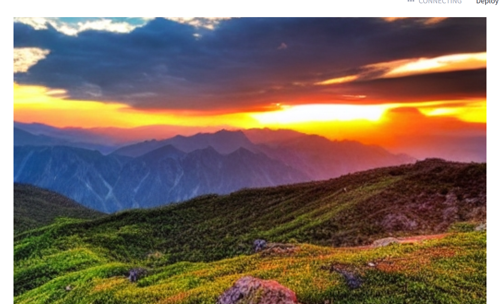

# AI Text-to-Image Generator

## Screenshot



## Description

A Streamlit-based AI application that converts text prompts into images using the Stable Diffusion model.

## Features

- Text-to-Image Generation
- Stable Diffusion AI Model
- Download Generated Images
- Prompt History
- Adjustable Image Size
- Adjustable Inference Steps

## Technologies Used

- Python
- Streamlit
- PyTorch
- Diffusers
- Pillow

## Run Project

```bash
pip install -r requirements.txt
streamlit run app.py
```

## Author

Samhitha M